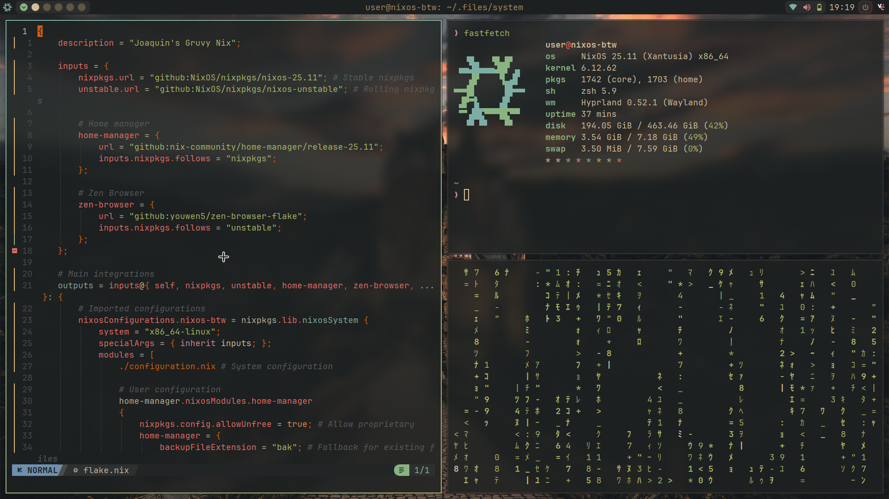
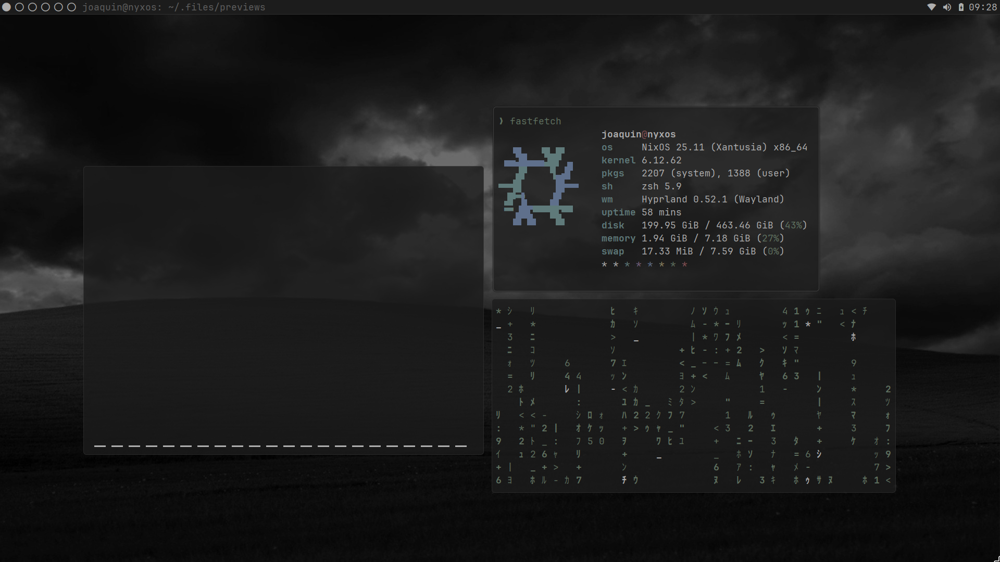
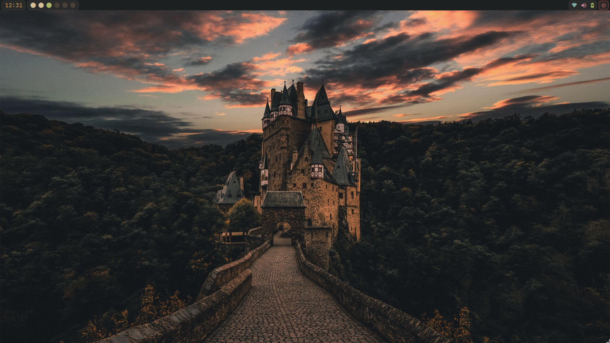
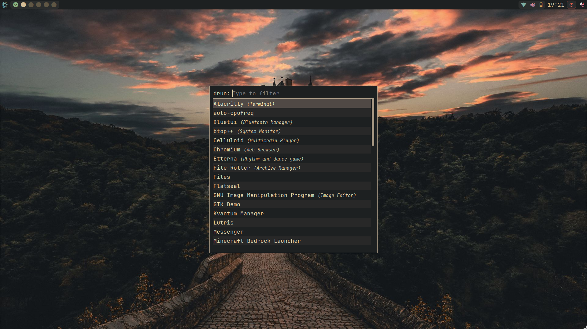

# NyxOS
A *modern, extensible* **Hyprland/Wayland** configuration for NixOS that embraces a dark aesthetic **without skimping on color**.

To install, simply cd into the cloned directory, and run: `sudo nixos-rebuild --impure --flake .#nixosConfigurations.nyx`

Preview images:

(Terminal applications)

(Background aesthetic)

